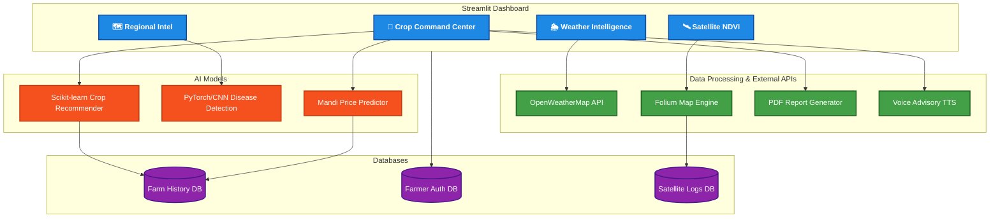

<div align="center">

# 🌾 AgriApp 2.0 — AgriTech AI

### AI-Powered Smart Agriculture Dashboard

[](https://python.org)
[](https://streamlit.io)
[](https://pytorch.org)
[](LICENSE)

*Empowering Indian farmers with AI-driven crop recommendations, disease detection, live Mandi pricing, satellite health monitoring, and weather intelligence — all in one dashboard.*

---

</div>

## 📋 Table of Contents

- [Features](#-features)
- [Tech Stack](#-tech-stack)
- [Architecture](#-system-architecture)
- [Installation](#-installation)
- [Usage](#-usage)
- [Project Structure](#-project-structure)
- [Screenshots](#-screenshots)
- [License](#-license)
- [Disclaimer](#%EF%B8%8F-disclaimer)

---

## ✨ Features

| # | Feature | Description |
|:--|:---|:---|
| 1 | 🤖 **AI Crop Recommendation** | Scikit-learn ML model predicts optimal crops based on N-P-K soil nutrients, pH, temperature, humidity, and rainfall |
| 2 | 🌿 **Crop Leaf Disease Detection** | PyTorch CNN + OpenCV pipeline for automated identification of crop diseases from leaf images |
| 3 | 💰 **Mandi Live Price Engine** | ML-based market price forecasting and investment cost estimation based on farm size and soil data |
| 4 | 🛰️ **Satellite NDVI Heatmap** | Real-time Normalized Difference Vegetation Index (NDVI) visualization with multi-zone health analysis using Folium |
| 5 | 🌦️ **Weather Intelligence** | Live weather API integration with 3-day forecasts, rain alerts, and farming advisories |
| 6 | 📊 **Soil Health Gauge** | Interactive Plotly gauge displaying real-time soil health scores based on nutrient and pH analysis |
| 7 | 🔐 **Farmer Authentication** | Secure login/registration portal with SQLite-backed user management |
| 8 | 📈 **Farm History & Analytics** | Historical trend charts tracking nitrogen, rainfall, and crop recommendation patterns over time |
| 9 | 🗣️ **Voice Advisory** | Text-to-speech crop recommendations using Google TTS (gTTS) for accessibility |
| 10 | 📄 **PDF Health Card Generator** | Automated PDF report generation with soil analysis, weather data, and crop recommendations |

---

## 🛠️ Tech Stack

<div align="center">

| Category | Technologies |
|:---|:---|
| **Frontend** | Streamlit, Plotly, Folium, Streamlit-Folium |
| **Machine Learning** | Scikit-learn, PyTorch, OpenCV, Joblib |
| **Data Processing** | Pandas, NumPy |
| **Database** | SQLite3 |
| **APIs** | OpenWeatherMap API, Google TTS (gTTS) |
| **Report Generation** | FPDF |
| **Language** | Python 3.10+ |

</div>

---

## 🏗️ System Architecture



---

## 🚀 Installation

### Prerequisites
- Python 3.10 or higher
- pip (Python package manager)

### Setup

1. **Clone the repository**
```bash
git clone https://github.com/prateek0208/AgriApp-2.0.git
cd AgriApp-2.0
```

2. **Install dependencies**
```bash
pip install streamlit pandas scikit-learn plotly folium streamlit-folium gtts fpdf joblib requests bcrypt
```

3. **Run the application**
```bash
streamlit run main.py
```

4. **Open in browser**
```
The app will automatically open at http://localhost:8501
```

---

## 💡 Usage

1. **Register/Login** — Create a farmer account or login with existing credentials
2. **Set Location** — Enter your state/city in the sidebar
3. **Input Soil Data** — Adjust N-P-K, pH, and rainfall sliders based on your soil test
4. **Run AI Analysis** — Click "RUN SYSTEM ANALYSIS" for crop recommendations
5. **Explore Tabs** — Navigate through Weather, Regional Intelligence, Farm History, and Satellite Health tabs
6. **Download Reports** — Generate and download PDF health cards for your records

---

## 📁 Project Structure

```
AgriApp-2.0/
├── models/
│   ├── my_crop_model.pkl      # Crop recommendation ML model
│   └── price_model.pkl        # Mandi price predictor model
├── database/
│   ├── farm_data.db           # Farm records
│   ├── farmer_auth.db         # User authentication records
│   └── farm_records.db        # Satellite records
├── main.py                    # Main Streamlit application
├── auth_manager.py            # User authentication (login/register)
├── price_engine.py            # Mandi price prediction engine
├── weather_intelligence.py    # Weather analysis & advisories
├── weather_main.py            # Weather data processing
├── weather_service.py         # Weather API integration
├── regional_intelligence.py   # Regional farming insights
├── satellite_engine.py        # Satellite NDVI analysis & heatmaps
├── satellite_database.py      # Satellite scan database
├── report_generator.py        # PDF report generation
├── LICENSE                    # Apache 2.0 License
├── .gitignore                 # Git ignore rules
└── README.md                  # Project documentation
```

---

## 📸 Screenshots

> *Screenshots coming soon — Run the app locally to explore the full interface!*

---

## 📜 License

This project is licensed under the **Apache License 2.0** — see the [LICENSE](LICENSE) file for details.

```
Copyright 2026 Prateek Ranjan

Licensed under the Apache License, Version 2.0 (the "License");
you may not use this file except in compliance with the License.
You may obtain a copy of the License at

    http://www.apache.org/licenses/LICENSE-2.0
```

---

## ⚠️ Disclaimer

> **This project is developed strictly for educational and academic purposes only.**
>
> The crop recommendations, disease detection results, weather forecasts, satellite NDVI indices, and Mandi price predictions generated by this application are based on machine learning models trained on limited datasets and simulated data. They are **not intended to replace professional agricultural advice, certified soil testing, or government-issued market pricing**.
>
> The developer makes **no warranties or guarantees** regarding the accuracy, reliability, or completeness of any information provided by this application. Users should always consult qualified agricultural experts, certified agronomists, and official government portals (such as [eNAM](https://enam.gov.in) and [Agmarknet](https://agmarknet.gov.in)) before making any farming or financial decisions.
>
> **Use this software at your own risk.** The developer shall not be held liable for any losses, damages, or adverse outcomes resulting from the use of this application.

---

<div align="center">

**Built with ❤️ by [Prateek Ranjan](https://github.com/prateek0208)**

⭐ *If you found this project useful, please consider giving it a star!* ⭐

</div>
