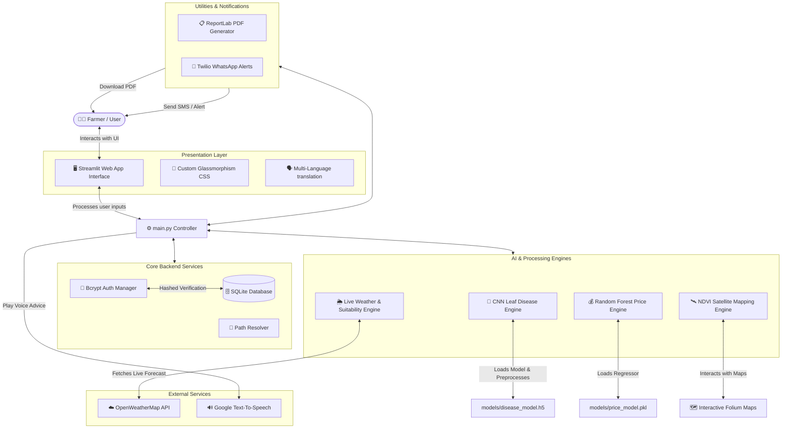

# 📐 System Architecture: AgriTech AI Platform

This document describes how the different components of the **AgriTech AI** system interact. It is written to be easily understood by non-technical reviewers, developers, and final-year project examiners.

---

## 🗺️ High-Level System Architecture Diagram

The diagram below shows how a farmer interacts with the application, how the Streamlit frontend coordinates requests, and how data flows through our backend engines, databases, and external APIs:

---

## 📂 File Structure & Module Responsibilities

The codebase is organized into highly focused folders. Here is what each folder does in plain English:

### 1. 🌟 Core Layer (`core/`)
This is the "foundation" of the project. It handles security, file paths, databases, and languages.
*   [paths.py](file:///c:/Users/Prateek/OneDrive/Desktop/AgriAPP%20-%20Copy/core/paths.py): Ensures the app never crashes due to file path errors. It automatically calculates the absolute path to any file (like models or databases) on Windows, macOS, or Linux.
*   [auth_manager.py](file:///c:/Users/Prateek/OneDrive/Desktop/AgriAPP%20-%20Copy/core/auth_manager.py): Manages user registration and login. It uses **Bcrypt** to hash and salt passwords, protecting user credentials.
*   [database.py](file:///c:/Users/Prateek/OneDrive/Desktop/AgriAPP%20-%20Copy/core/database.py): Handles the main local SQLite database where all farm history, crop records, and diagnostics are securely saved.
*   [language_pack.py](file:///c:/Users/Prateek/OneDrive/Desktop/AgriAPP%20-%20Copy/core/language_pack.py): Supports multi-lingual translations (English and Hindi), allowing farmers to read the platform in their preferred language.

### 2. 🧠 AI & Analytical Engines (`engines/`)
These files act as the "brain" of the application, running calculations and artificial intelligence models.
*   [disease_engine.py](file:///c:/Users/Prateek/OneDrive/Desktop/AgriAPP%20-%20Copy/engines/disease_engine.py): Manages leaf photo uploads. It automatically detects which neural network is active, pre-processes the leaf image to fit the model parameters, runs the prediction, and generates specific organic and chemical treatment advice.
*   [price_engine.py](file:///c:/Users/Prateek/OneDrive/Desktop/AgriAPP%20-%20Copy/engines/price_engine.py) & [mandi_engine.py](file:///c:/Users/Prateek/OneDrive/Desktop/AgriAPP%20-%20Copy/engines/mandi_engine.py): Use machine learning regression models to calculate investment metrics and historical market crop rates to help farmers budget effectively.
*   [weather_service.py](file:///c:/Users/Prateek/OneDrive/Desktop/AgriAPP%20-%20Copy/engines/weather_service.py) & [weather_intelligence.py](file:///c:/Users/Prateek/OneDrive/Desktop/AgriAPP%20-%20Copy/engines/weather_intelligence.py): Connect to the OpenWeatherMap REST API, calculate daily farm planting suitability scores, and display forecasts.
*   [satellite_engine.py](file:///c:/Users/Prateek/OneDrive/Desktop/AgriAPP%20-%20Copy/engines/satellite_engine.py) & [satellite_database.py](file:///c:/Users/Prateek/OneDrive/Desktop/AgriAPP%20-%20Copy/engines/satellite_database.py): Generate high-resolution interactive farm maps using **Folium**, simulating Normalized Difference Vegetation Index (NDVI) heatmap layers to analyze crop health visually over time.

### 3. 📋 Utilities & Alerts (`utils/` & `alerts/`)
These modules handle exporting documents and dispatching mobile alerts.
*   [report_generator.py](file:///c:/Users/Prateek/OneDrive/Desktop/AgriAPP%20-%20Copy/utils/report_generator.py): Compiles soil cards, weather metrics, and ML diagnostics into a clean PDF document for physical distribution.
*   [whatsapp_alerts.py](file:///c:/Users/Prateek/OneDrive/Desktop/AgriAPP%20-%20Copy/alerts/whatsapp_alerts.py) & [backend_alerts.py](file:///c:/Users/Prateek/OneDrive/Desktop/AgriAPP%20-%20Copy/alerts/backend_alerts.py): Manage automated agricultural push alerts, using Twilio's WhatsApp API to dispatch warnings directly to farmers' mobile devices when weather conditions change.

---

## 🔄 Simple Step-by-Step Data Flow

Here is a walk-through of exactly what happens when a farmer uploads a leaf image to diagnose a crop disease:

1. **Upload:** The farmer uploads a leaf picture in the **Streamlit Web UI**.
2. **Preprocessing:** [disease_engine.py](file:///c:/Users/Prateek/OneDrive/Desktop/AgriAPP%20-%20Copy/engines/disease_engine.py) receives the raw image bytes, resizes the image to `224x224` pixels, and normalizes it to fit the input expectations of the active deep learning model.
3. **Inference:** The **DSANet v2 CNN Model** processes the pixels and outputs a set of probabilities for all 38 classes. The index with the highest probability is mapped to its class name (e.g., `Tomato___Early_blight`).
4. **Treatment Lookup:** The engine matches the disease name with organic and chemical treatments.
5. **Rendering & Database Logging:** The Streamlit UI displays the diagnosis with a color-coded status bar (e.g., green for healthy, red for critical blight). Simultaneously, [database.py](file:///c:/Users/Prateek/OneDrive/Desktop/AgriAPP%20-%20Copy/core/database.py) saves a log of this checkup into the farmer's history file.
6. **Voice Synthesis (Optional):** If the farmer clicks the "Audio Advice" speaker, Google Text-to-Speech synthesizes the recommended actions into spoken audio.
